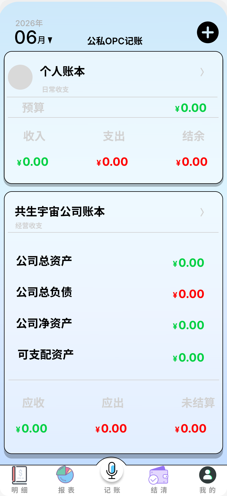

<p align="center">
  
</p>

<h1 align="center">店主记账本</h1>

<p align="center">
  公私分离 · OCR 扫描 · 语音记账 · 多端同步
</p>

<p align="center">
  
  
  
</p>

---

## 功能

| 模块 | 说明 |
|------|------|
| **明细** | 个人 / 公司双账本，按日分组，搜索筛选 |
| **记账** | 收入 / 支出 / 垫付 / 应付四类，内部对象联动 |
| **报表** | 月度汇总 + 分类拆解 + 图表切换（柱状/饼图/折线） |
| **结清** | 垫付 → 应付 → 结清闭环，作废保护 |
| **扫描凭证** | 拍照 OCR 自动识别金额/分类/备注 |
| **语音记账** | ASR 一句话语音转文字，自动填单 |
| **多端同步** | 脏标记增量推送 + 冲突面板裁决 |
| **导出** | Excel 多 sheet 导出 |

## 截图

<div align="center">
  
</div>

## 技术栈

- **框架**：微信小程序原生 + Skyline 渲染引擎 + glass-easel 组件框架
- **UI**：无边框柔影风格，自适应卡片布局
- **数据**：本地 Storage + 后端 API 双存储，离线队列 + 网络恢复重放
- **AI**：阿里云 OCR 文字识别 + ASR 语音识别

## 项目结构

```
├── pages/
│   ├── mingxi/          # 明细（核心页）
│   ├── baobiao/         # 报表
│   ├── jizhang/         # 记账弹窗
│   ├── jieqing/         # 结清
│   └── wode/            # 我的
├── utils/
│   ├── api.js           # 数据接口层（Storage + 网络）
│   ├── i18n.js          # 多语言（简中/繁中/日/英）
│   └── xlsx.js          # Excel 导出
├── components/
│   └── navigation-bar/  # 自定义导航栏
├── assets/              # 图标 + 截图
├── app.js               # 入口
├── app.json             # 配置（含分包）
└── app.wxss              # 全局样式
```

## 快速开始

1. 克隆仓库
```bash
git clone git@github.com:SymbioticUniverse/-Shopkeeper-s-Bookkeeping-Mini-Program-Version.git
```

2. 用[微信开发者工具](https://developers.weixin.qq.com/miniprogram/dev/devtools/download.html)打开项目目录

3. 修改 `utils/api.js` 中的 `BASE_URL` 为你的后端地址

4. 填入 AppID（`project.config.json` → `appid`）

5. 编译预览

## 后端

本仓库仅包含小程序前端代码。后端 API 服务为独立闭源项目，需自行部署。

API 协议参见 [API.md](./API.md)。

## 许可证

MIT License — 详见 [LICENSE](./LICENSE)
